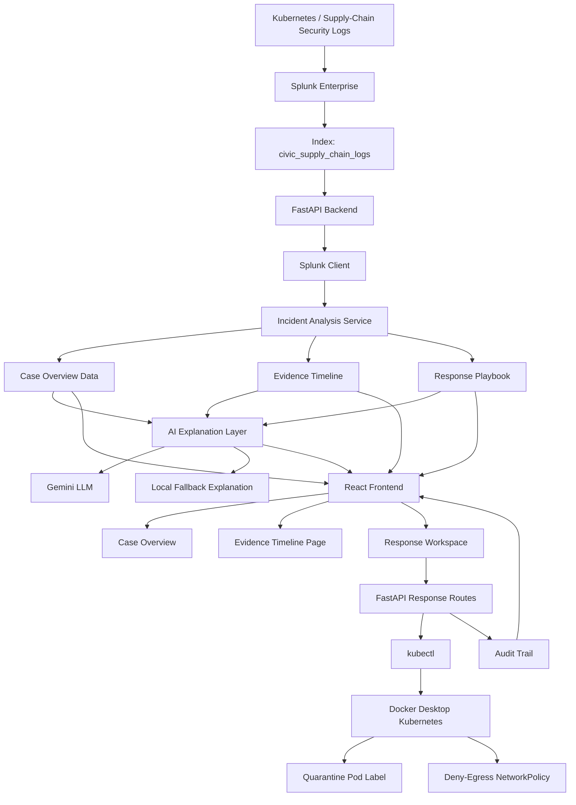
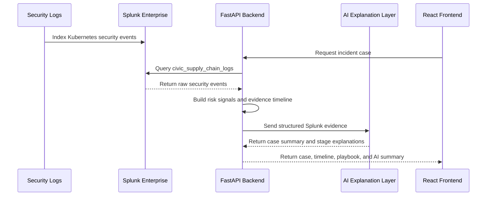
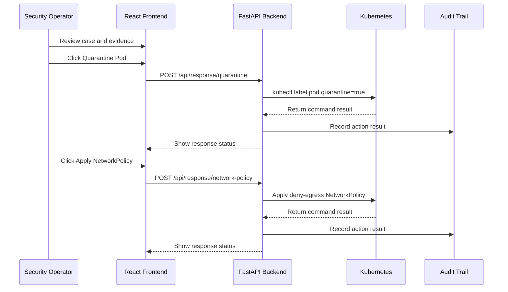

# CivicShield Architecture

CivicShield connects Splunk security logs, AI explanation, and Kubernetes response actions into one incident response workflow.

## High-Level Flow

## What Each Part Does

| Part | Role |
|---|---|
| Splunk Enterprise | Stores the security logs and acts as the evidence source |
| FastAPI Backend | Queries Splunk, analyzes events, and builds the incident workflow |
| Splunk Client | Reads events from the Splunk index |
| Incident Analysis Service | Maps raw events into risk signals, risk score, case summary, and evidence stages |
| AI Explanation Layer | Sends structured evidence to Gemini and receives readable explanations |
| React Frontend | Shows the case overview, evidence timeline, response workspace, and audit trail |
| Kubernetes | The target environment where containment actions are applied |
| Audit Trail | Records user-triggered response actions |

## Splunk Data Flow

## Response Flow

## Design Notes

CivicShield keeps the response workflow human-in-the-loop.

The AI explanation layer helps the user understand the Splunk evidence, but it does not execute actions automatically. The user reviews the evidence first, then chooses whether to run Kubernetes containment actions.

Splunk remains the source of truth for the incident evidence. CivicShield adds a workflow layer for investigation, explanation, response, and audit.

## Future Architecture Ideas

The current demo uses Gemini as the external LLM provider. A future version could replace or extend this layer with:

- Splunk MCP Server
- Splunk Hosted Models
- Splunk AI Assistant workflows
- response audit events written back into Splunk